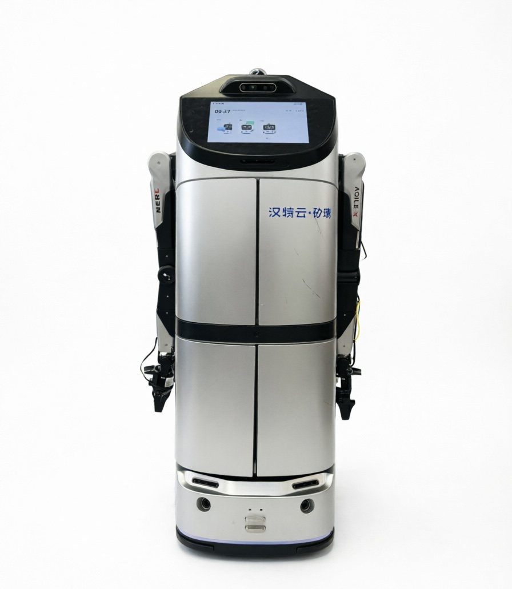

# Hantewin BenBen — Robonix Robot Deployment

<p align="center">
  
</p>

Robonix deployment repository for the **Hantewin BenBen** mobile robot.

This repository provides a Robonix deployment configuration for the BenBen robot, integrating differential-drive chassis control (TBox SDK), Livox MID-360 3D LiDAR, RichBeam LakiBeam1 2D LiDAR, Intel RealSense D435i RGB-D camera, RTAB-Map SLAM mapping/localization, point-to-point navigation, speech interaction, scene understanding, and an AgileX Nero 7-DOF manipulator arm.

## Overview

The deployment integrates the BenBen robot with the Robonix runtime and exposes robot hardware and application capabilities through Robonix primitives, services, and skills.

Main capabilities include:

- BenBen chassis motion and posture control via the TBox C++ SDK and remote ros1 node
- Livox MID-360 3D LiDAR (PointCloud2) and its built-in 6-axis IMU
- RichBeam LakiBeam1 2D planar LiDAR (LaserScan)
- Intel RealSense D435i RGB-D camera (RGB + aligned depth)
- RTAB-Map SLAM for 2D occupancy-grid / 3D point-cloud mapping and localization
- Point-to-point navigation on the vendor TBox onboard map
- Speech recognition and wake-word interaction (Tencent ASR/TTS)
- Vision-language-model (VLM) based scene understanding
- AgileX Nero 7-DOF arm with joint/Cartesian control, gripper, and VLM-guided grasp
- Robonix chassis control and navigation skills

## Configure

Before booting, complete the following setup:

1. **TBox SDK token** — the `benben_chassis` primitive authenticates to the vendor TBox controller with a development token issued by the manufacturer. Provide it via the manifest `config.token` field or the `BENBEN_TBOX_TOKEN` environment variable (recommended in `~/.robonix/secrets.env`); the driver will not initialize without it.

2. **Network connectivity** — the chassis sits at `192.168.10.1` . Ensure the main control computer, the chassis, and the LiDAR are mutually reachable. The MID-360 LiDAR lives on a separate subnet, configured via `lidar_ip` / `host_ip` in [robonix_manifest.yaml](robonix_manifest.yaml).

3. **Chassis-side ROS 1 bridge** — compile and run [primitives/chassis/chassis_driver/tbox_sdk/vel_cmd_udp_server.cpp](primitives/chassis/chassis_driver/tbox_sdk/vel_cmd_udp_server.cpp) on the chassis controller. This ROS 1 node listens for velocity commands on UDP port `11451` and forwards them to the chassis `/cmd_vel/input/manual` topic, switching `/Mode` between manual and autonomous control.

## Architecture

```text
                         Robonix
                            │
        ┌───────────────────┼───────────────────┐
        │                   │                   │
    Primitives           Services             Skills
        │                   │                   │
        ├─ benben_chassis    ├─ speech           ├─ p2pmov
        ├─ mid360_lidar      │  (Tencent ASR/TTS) ├─ nero_grasp
        ├─ mid360_imu        ├─ mapping          ├─ nero_return_home
        ├─ lakibeam1_lidar   │  (RTAB-Map SLAM)  └─ nero_wave
        ├─ realsense_camera  └─ scene
        ├─ robot_description     (VLM)
        ├─ left_arm
        ├─ audio_driver
        └─ audio_client_bridge
        │
        ▼
 ┌──────────────────────────────────────────────────┐
 │                Hantewin BenBen                   │
 │                                                  │
 │  Chassis / TBox   MID-360    LakiBeam1   D435i   │
 │       │              │          │         │      │
 │    /cmd_vel      PointCloud   LaserScan  RGB-D  │
 │    /odom            /livox/imu                   │
 └──────────────────────────────────────────────────┘
```

## Repository Structure

```text
.
├── robonix_manifest.yaml          # main deployment manifest
├── soma.yaml                      # robot model, footprint, capability exports
├── robot.urdf                     # base / lidar / IMU link tree
│
├── config/
│   ├── nav2_params.yaml           # Nav2 parameters
│   ├── navigate.xml               # Nav2 behavior tree
│   ├── old_nav2_params.yaml       # legacy Nav2 parameters
│   └── rtabmap_params.yaml        # RTAB-Map parameters
│
├── primitives/
│   ├── chassis/                   # benben_chassis (TBox SDK)
│   ├── lakiBeam1-lidar/           # LakiBeam1 2D LiDAR bridge
│   ├── nero_arm/                  # AgileX Nero arm driver (local copy)
│   ├── primitive-livox-mid360-imu-rbnx/      # MID-360 IMU shim
│   └── primitive-livox-mid360-lidar-rbnx/    # MID-360 LiDAR driver
│
├── services/
│   └── service-map-rbnx/          # RTAB-Map SLAM mapping service
│
├── skills/
│   └── p2pmov/                    # point-to-point navigation skill
│
├── scripts/
│   └── monitor_odom_drift.py
│
├── assets/
│   └── benben.jpg
└── rbnx-boot/                     # runtime instances, cache, and logs
```

## Robonix Components

### Primitives

| Component | Description |
| --- | --- |
| `benben_chassis` | Converts velocity commands (`/cmd_vel`) to TBox SDK calls and bridges the controller's ROS 1 `/odom` stream into ROS 2 |
| `mid360_lidar` | Provides Livox MID-360 PointCloud2 on `/scanner/cloud` |
| `mid360_imu` | Atlas-registers the MID-360 built-in IMU stream on `/livox/imu` |
| `lakibeam1_lidar` | Provides the LakiBeam1 2D LaserScan on `/scan` via direct TCPROS bridge |
| `realsense_camera` | Provides RealSense D435i RGB and aligned depth streams |
| `robot_description` | Publishes `/robot_description` and the standard TF tree from the Soma-owned URDF |
| `left_arm` | AgileX Nero 7-DOF arm: joint / Cartesian / gripper control (referenced from the external `agilex_nero` repo) |
| `audio_driver` | Provides microphone and speaker interfaces |
| `audio_client_bridge` | Audio transport bridge for speech I/O |

### Services

| Component | Description |
| --- | --- |
| `speech` | Speech recognition and wake-word service (Tencent ASR/TTS) |
| `mapping` | RTAB-Map SLAM: 2D occupancy grid, 3D point cloud, pose, and map save/load (see note below) |
| `scene` | VLM-based scene understanding, object memory, and scene graph |

### Skills

| Component | Description |
| --- | --- |
| `p2pmov` | Point-to-point navigation to named points or raw coordinates on the vendor TBox map |
| `nero_grasp` | VLM-guided object grasp with the Nero arm |
| `nero_return_home` | Return the arm to its home pose |
| `nero_wave` | Scripted waving motion |

> The `mapping`, `scene`, and `nav2` service blocks are present in the deployment (environment variables, `soma.yaml` capability exports, and `config/` files) but are currently commented out in [robonix_manifest.yaml](robonix_manifest.yaml). Startup is driven by that manifest, so only the active blocks above are launched by `rbnx boot`.

## Chassis Integration

The BenBen chassis is connected to Robonix through the `benben_chassis` primitive, which wraps the TBox C++ SDK (`libtbox_sdk_cpp.so`).

The control path is:

```text
User / Robonix
      │
      ▼
p2pmov / move / twist_in
      │
      ▼
benben_chassis
      │
      ▼
TBox SDK / /cmd_vel
      │
      ▼
BenBen Robot Controller
```

The driver exposes three capability contracts:

- `robonix/primitive/chassis/move` — discrete motion (`forward_m`, `rotate_deg`, or raw `linear_x` / `angular_z` velocity bursts)
- `robonix/primitive/chassis/twist_in` — continuous `geometry_msgs/Twist` stream on `/cmd_vel` (used by the navigation stack)
- `robonix/primitive/chassis/odom` — `nav_msgs/Odometry` republished from the controller's ROS 1 `/odom` stream at 50 Hz

The driver runs natively on the host (no Docker) and initializes the TBox SDK during the `Driver(CMD_INIT)` lifecycle call.

## Navigation

The deployment uses two distinct navigation stacks, which operate in **different coordinate frames** and must not be mixed:

1. **Vendor TBox onboard map** — the `p2pmov` skill dispatches goals through the TBox SDK `task_distribution(x, y, yaw, map_name, …)`. The chassis navigates autonomously on its onboard vendor map; obstacle avoidance is handled by vendor firmware, not Robonix Nav2.

2. **Robonix RTAB-Map SLAM** — the `mapping` service builds and localizes against a 2D occupancy grid / 3D point cloud map. Navigation on this frame is provided by the (currently commented-out) `nav2` service.

```text
config/
├── nav2_params.yaml
├── navigate.xml
└── rtabmap_params.yaml
```

Do not route a `p2pmov` point name through `scene goal_near` / `goal_room`: those resolve poses on the RTAB-Map frame, which does not match the vendor map. See [skills/p2pmov/CAPABILITY.md](skills/p2pmov/CAPABILITY.md) for the intent-routing rules.

## Configuration

The main deployment configuration is [robonix_manifest.yaml](robonix_manifest.yaml). The deployment root should be provided through:

```bash
export ROBONIX_DEPLOY_DIR=/path/to/robot-hantewin-benben
```

VLM credentials must be provided through environment variables and must not be committed to the repository:

```bash
export VLM_BASE_URL="your-vlm-base-url"
export VLM_API_KEY="your-api-key"
export VLM_MODEL="your-model"
export TENCENT_ASR_APPID="your-tencent-appid"
```

The manifest references a secrets file for sourcing credentials:

```bash
set -a; source ~/.robonix/secrets.env; set +a
```

Additional platform settings (ROS 2 distro, build target, scene/mapping platform) are configured through the manifest's `env:` block. This deployment targets the **Jetson AGX Thor** (`jetson_thor`) with **ROS 2 Jazzy** and native (non-Docker) builds (`RBNX_BUILD_TARGET: jetson-native`).

## Hardware

The current deployment is designed for:

- Hantewin BenBen mobile robot (differential-drive base, TBox controller)
- Livox MID-360 3D LiDAR (with built-in IMU)
- RichBeam LakiBeam1 2D LiDAR
- Intel RealSense D435i RGB-D camera
- AgileX Nero 7-DOF arm (with `agx_gripper` effector, CAN `can_piper`)
- USB microphone / USB speaker
- Jetson AGX Thor onboard computing platform

Hardware device names, network interfaces, ROS topics, LiDAR IPs, and audio devices may need to be adjusted for the target robot. In particular, the MID-360 LiDAR IP, host IP, and the robot controller's ROS 1 URI are config-driven and robot-specific.

## Security

API keys and other credentials must not be committed to this repository.

Use environment variables or local ignored configuration files (e.g. `~/.robonix/secrets.env`) for sensitive information.

The mapping Web UI is unauthenticated and binds `0.0.0.0` in this deployment (`MAPPING_WEBUI_HOST`) — only expose it on a trusted LAN.

Build outputs, logs, caches, and local environment files are excluded through `.gitignore`.

## License

MulanPSL-2.0 (see each package's `package_manifest.yaml`). Vendored third-party sources retain their own licenses (e.g. `livox_ros_driver2` is BSD).

## Maintainer

Futaba19-c <futaba19c@foxmail.com>

Repository: https://github.com/syswonder/robot-hantewin-benben
