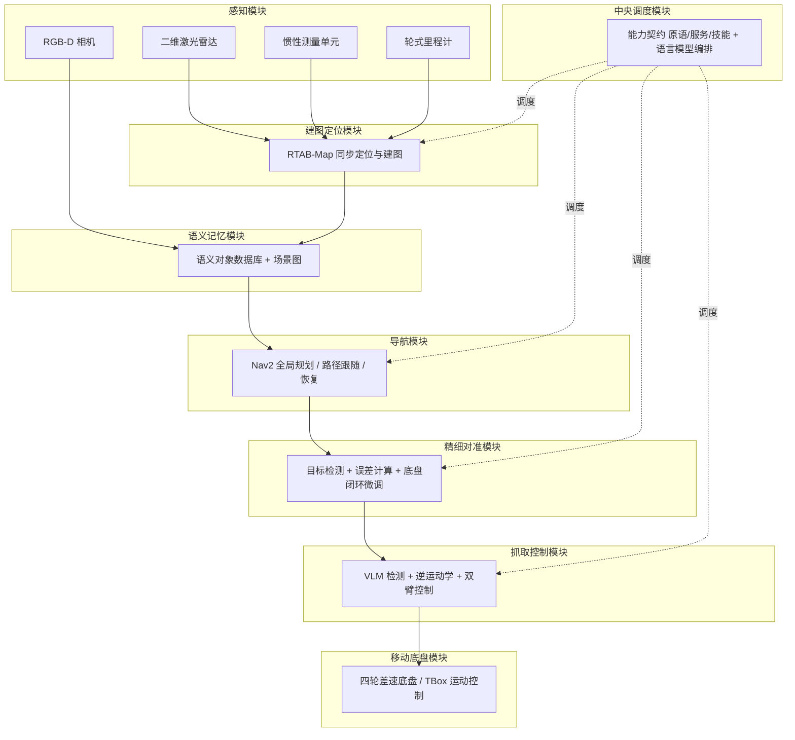
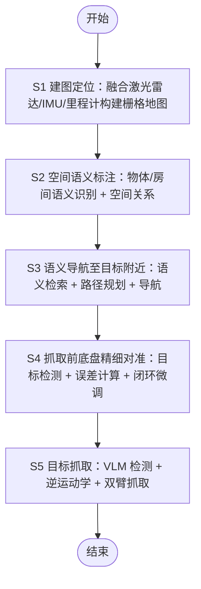
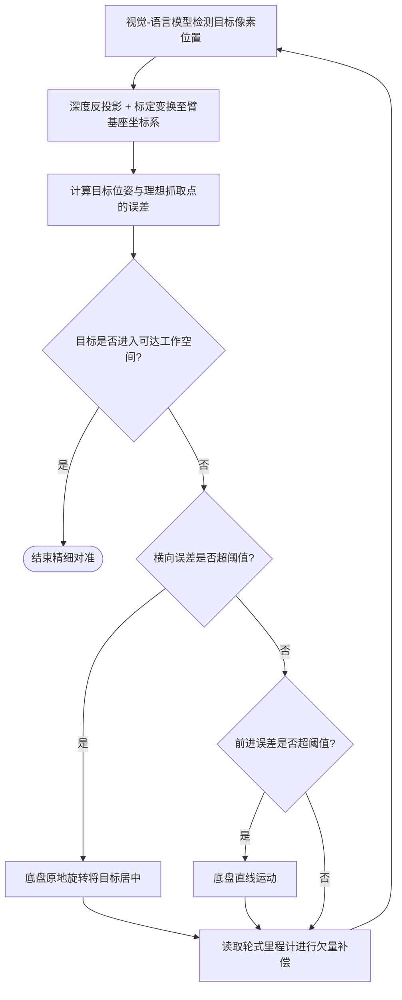
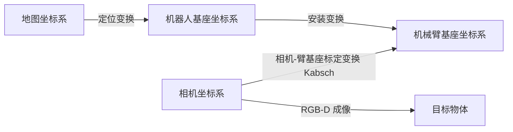
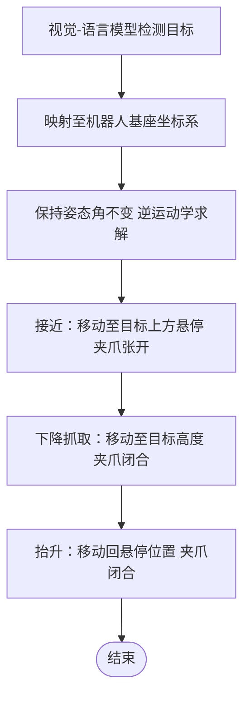
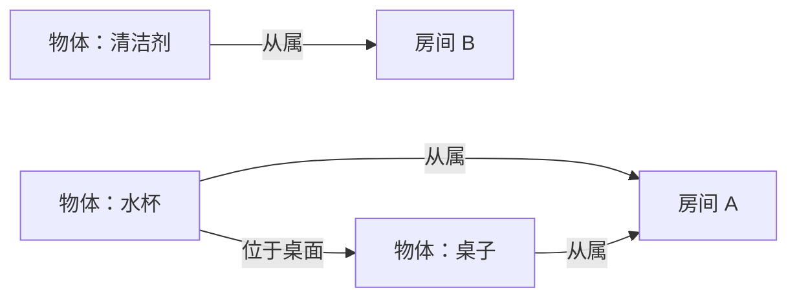

# 专利附图（Mermaid 源文件）

> 对应《专利初稿.md》的 6 张图。用法：
> - VSCode 安装 Mermaid 预览插件（Markdown Preview Mermaid Support）直接渲染截图；
> - 或把各代码块粘贴到 mermaid.live 导出 SVG/PNG；
> - 或作为 Visio 绘制的结构参考。

---

## 图 1　一体化系统整体结构框图

---

## 图 2　一体化方法总流程图

---

## 图 3　S4 抓取前底盘精细对准闭环流程图

---

## 图 4　坐标系变换关系示意图

---

## 图 5　S5 双臂抓取流程图

---

## 图 6　语义对象记忆与空间关系示意图

